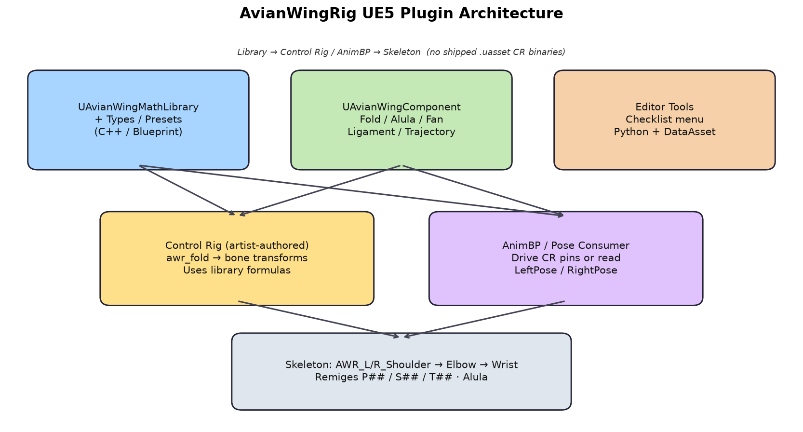
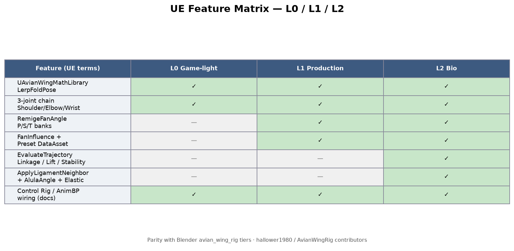
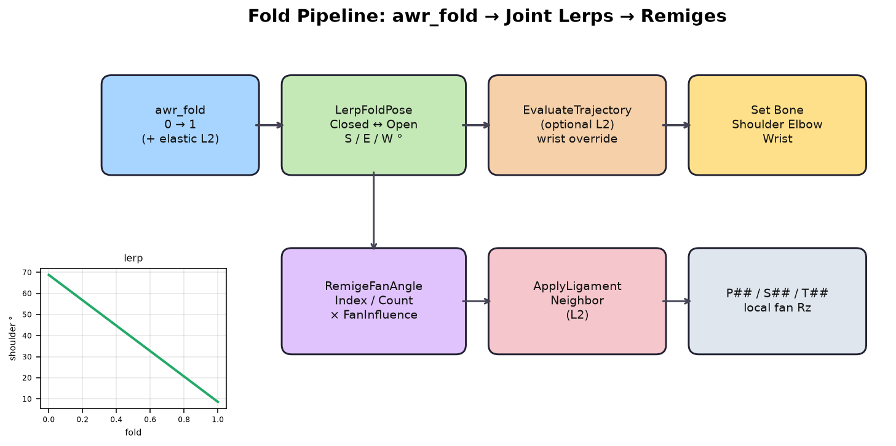

# AvianWingRig (Unreal Engine 5)

**Public-safe** Unreal Engine 5.3+ plugin: avian wing **fold / remige / alula** math library, runtime component, species presets, and editor utilities for wiring **Control Rig** and **AnimBP**.

Sibling Blender addon: [hallower1980/avian-wing-rig](https://github.com/hallower1980/avian-wing-rig)  

> **No binary Control Rig `.uasset` files are shipped.** This repo provides C++ / Blueprint APIs + docs so you can author Control Rigs in your project.

*Figure: Library and component feed an artist-authored Control Rig / AnimBP that drives `AWR_*` bones.*

## Features by tier (UE terms)

| Tier | Name | What you get |
|------|------|----------------|
| **L0** | Game-light | `LerpFoldPose` → Shoulder / Elbow / Wrist; `UAvianWingComponent` fold float |
| **L1** | Production | `RemigeFanAngle` for `P##` / `S##` / `T##`; `awr_fan_influence`; Magpie `UAvianWingPresetDataAsset` |
| **L2** | Bio | `EvaluateTrajectory`, `ApplyLigamentNeighbor`, `AlulaAngle`, elastic fold bias |

## Install

1. Copy `Plugins/AvianWingRig/` into your UE5.3+ project's `Plugins/` folder  
   (or clone this repo and add it as an Engine/project plugin path).
2. Right-click your `.uproject` → **Generate Visual Studio project files** (or open the project and let UE rebuild).
3. **Edit → Plugins** → search **AvianWingRig** → enable → restart editor.
4. Confirm modules `AvianWingRig` (Runtime) and `AvianWingRigEditor` (Editor) load.

Requires a **C++** project (or converting your BP project to C++) so the plugin can compile.

## Quick start

*Figure: `awr_fold` drives joint lerps; L1 fans remiges; L2 can override wrist via trajectory.*

1. **Tools → AvianWingRig: Print Setup Checklist** (Output Log), or run `Content/Python/awr_setup_checklist.py`.
2. **Tools → AvianWingRig: Create Magpie Preset DataAsset** → `/Game/AvianWingRig/DA_AWR_Magpie`.
3. Add `UAvianWingComponent` to a bird actor; scrub **Fold** 0→1.
4. Follow [docs/WALKTHROUGH.md](docs/WALKTHROUGH.md) for L0 → L1 → L2 Control Rig / AnimBP wiring.
5. Call Blueprint nodes under **AvianWing** (e.g. `Lerp Fold Pose`, `Evaluate Trajectory`).

### Fold defaults (Magpie / Blender parity)

Blender stores radians in `constants.py`; UE library exposes **degrees**:

| Pose | Shoulder | Elbow | Wrist |
|------|----------|-------|-------|
| OPEN | 0.15 rad ≈ **8.59°** | −0.10 ≈ **−5.73°** | 0.05 ≈ **2.86°** |
| CLOSED | 1.20 rad ≈ **68.75°** | 2.10 ≈ **120.32°** | 1.40 ≈ **80.21°** |

`PRIMARY_COUNT = 10`; primary fan max ≈ **0.95 rad**. Trajectories: **Linkage** / **ConstantLift** / **ConstantStability**.

### Naming (do not rename casually)

- Bones: `AWR_L/R_Shoulder`, `_Elbow`, `_Wrist`, `_P##`, `_S##`, `_T##`, `_Alula`
- Props / CR floats: `awr_fold`, `awr_alula`, `awr_trajectory`, `awr_elastic`, `awr_ligament_strength`, `awr_fan_influence`

## Documentation

| Doc | Contents |
|-----|----------|
| [docs/WALKTHROUGH.md](docs/WALKTHROUGH.md) | Install → L0 → L1 → L2 → AnimBP |
| [docs/MECHANICS.md](docs/MECHANICS.md) | Short mechanics + Blender parity |
| [docs/CONTROL_RIG.md](docs/CONTROL_RIG.md) | How to wire Control Rig with this library |
| [DECISION.md](DECISION.md) | Separate Blender / UE repos recommendation |

## License

MIT — see [LICENSE](LICENSE). Copyright (c) 2026 AvianWingRig contributors.
